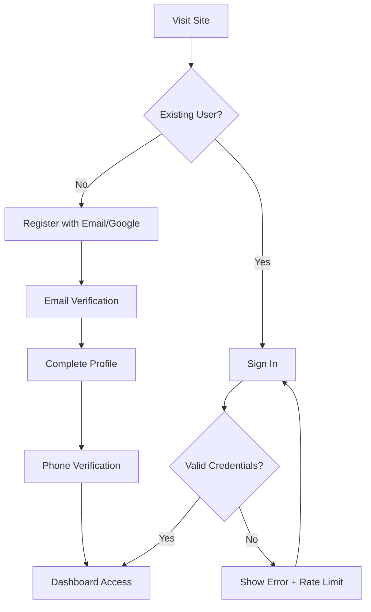
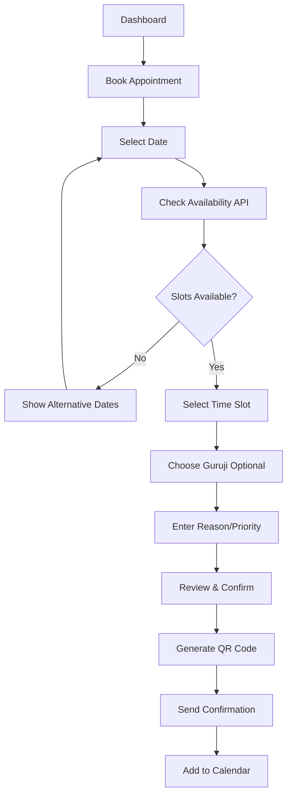
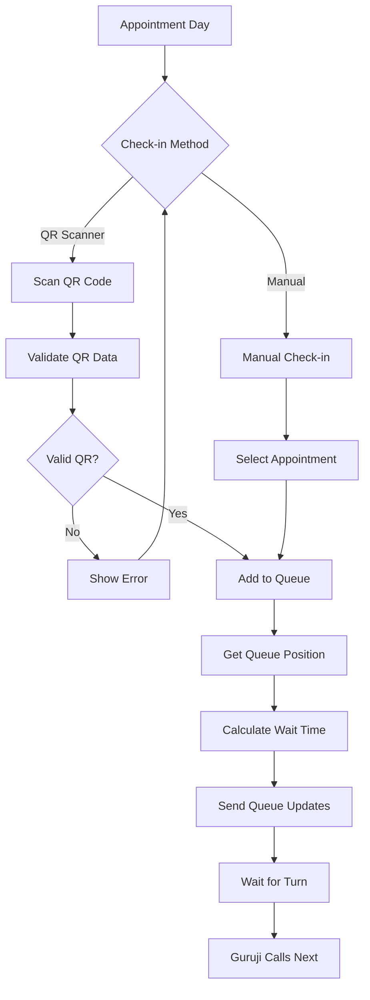
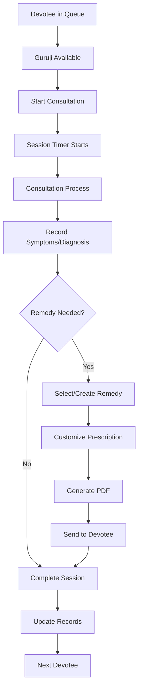
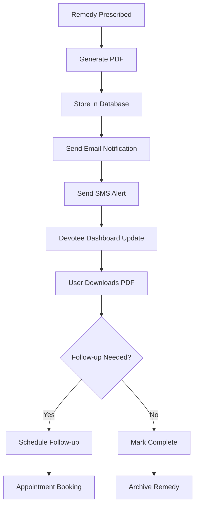
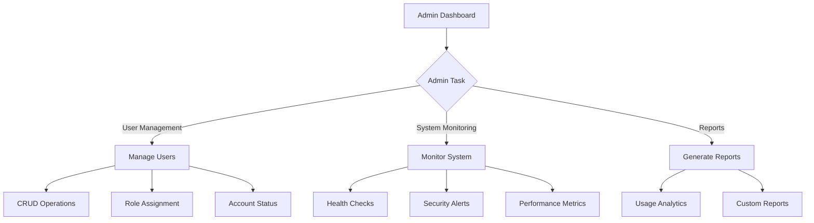
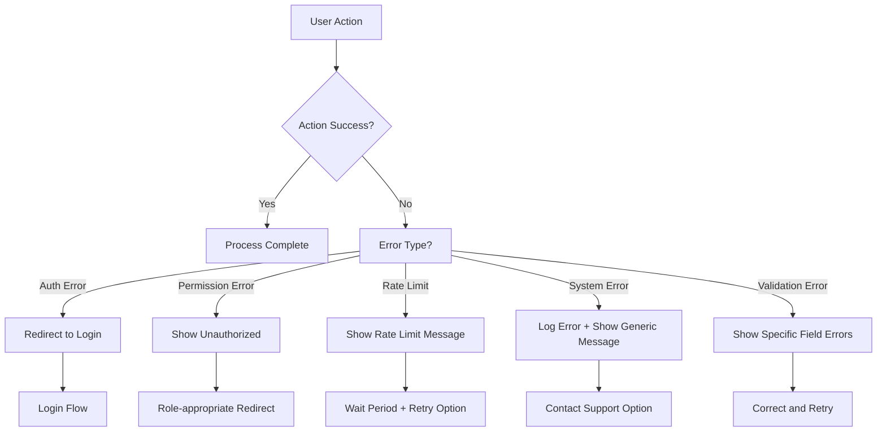

# Shivgoraksha Ashram Management System - Complete Documentation

## Table of Contents
1. [System Overview](#system-overview)
2. [Architecture & Technology Stack](#architecture--technology-stack)
3. [Database Schema](#database-schema)
4. [Authentication & Authorization](#authentication--authorization)
5. [User Roles & Permissions](#user-roles--permissions)
6. [API Endpoints & Server Actions](#api-endpoints--server-actions)
7. [User Flow Documentation](#user-flow-documentation)
8. [Security Features](#security-features)
9. [Real-time Features](#real-time-features)
10. [File Structure](#file-structure)

---

## System Overview

The **Shivgoraksha Ashram Management System** is a comprehensive healthcare management platform built for spiritual healthcare institutions. It manages devotee appointments, consultations, remedy prescriptions, and queue management with role-based access control.

### Key Features
- **Multi-role System**: USER, COORDINATOR, GURUJI, ADMIN
- **Appointment Management**: Booking, scheduling, check-in, cancellation
- **Queue Management**: Real-time devotee queue with position tracking
- **Consultation System**: Session management with timing and documentation
- **Remedy System**: Digital prescription management with templates
- **QR Code Integration**: Quick check-in and devotee identification
- **Real-time Updates**: Live queue status and notifications
- **Multi-language Support**: English, Hindi, Sanskrit

---

## Architecture & Technology Stack

### Frontend
- **Framework**: Next.js 15.4.5 with App Router
- **UI Library**: React 19.1.0 with Radix UI components
- **Styling**: Tailwind CSS 4.0
- **State Management**: Zustand + React Query (TanStack Query)
- **Forms**: React Hook Form with Zod validation
- **Icons**: Lucide React
- **Animations**: Framer Motion

### Backend
- **Runtime**: Node.js with Next.js Server Actions
- **Database**: PostgreSQL with Prisma ORM
- **Authentication**: NextAuth.js with JWT
- **File Handling**: QR code generation, PDF creation
- **Caching**: Next.js unstable_cache with Redis-like functionality

### Security & Performance
- **Rate Limiting**: Custom implementation with exponential backoff
- **Security Headers**: CSP, HSTS, XSS protection
- **Input Validation**: Zod schemas throughout
- **Audit Logging**: Comprehensive activity tracking
- **Performance**: Server-side caching with cache invalidation

---

## Database Schema

### Core Entities

#### User Management
```typescript
// User model - Central entity for all system users
User {
  id: String (CUID)
  name: String?
  email: String? (unique)
  password: String? (bcrypt hashed)
  role: Role (USER|COORDINATOR|GURUJI|ADMIN)
  phone: String? (unique)
  dateOfBirth: DateTime?
  address: String?
  emergencyContact: String?
  preferences: Json?
  isActive: Boolean (default: true)
  createdAt: DateTime
  updatedAt: DateTime
}

// Authentication support
Account {
  id: String (CUID)
  userId: String
  type: String
  provider: String (credentials|google)
  providerAccountId: String
  refresh_token: String?
  access_token: String?
  expires_at: Int?
  // ... other OAuth fields
}

Session {
  id: String (CUID)
  sessionToken: String (unique)
  userId: String
  expires: DateTime
}
```

#### Appointment System
```typescript
Appointment {
  id: String (CUID)
  userId: String (devotee)
  gurujiId: String? (assigned guruji)
  date: DateTime
  startTime: DateTime
  endTime: DateTime
  status: AppointmentStatus (BOOKED|CONFIRMED|CHECKED_IN|IN_PROGRESS|COMPLETED|CANCELLED|NO_SHOW)
  priority: Priority (LOW|NORMAL|HIGH|URGENT)
  reason: String?
  notes: String?
  isRecurring: Boolean
  recurringPattern: Json?
  qrCode: String? (unique - embedded QR data)
  checkedInAt: DateTime?
  createdAt: DateTime
  updatedAt: DateTime
}

QueueEntry {
  id: String (CUID)
  appointmentId: String (unique)
  userId: String (devotee)
  gurujiId: String? (assigned guruji)
  position: Int
  status: QueueStatus (WAITING|IN_PROGRESS|COMPLETED|CANCELLED|NO_SHOW|LATE_ARRIVAL)
  priority: Priority
  estimatedWait: Int? (minutes)
  checkedInAt: DateTime
  startedAt: DateTime?
  completedAt: DateTime?
  notes: String?
  createdAt: DateTime
  updatedAt: DateTime
}
```

#### Consultation & Remedy System
```typescript
ConsultationSession {
  id: String (CUID)
  appointmentId: String (unique)
  devoteeId: String
  gurujiId: String
  startTime: DateTime (default: now)
  endTime: DateTime?
  duration: Int? (minutes)
  symptoms: String?
  diagnosis: String?
  notes: String?
  recordings: Json? (audio/video URLs)
  createdAt: DateTime
  updatedAt: DateTime
}

RemedyTemplate {
  id: String (CUID)
  name: String
  type: RemedyType (HOMEOPATHIC|AYURVEDIC|SPIRITUAL|LIFESTYLE|DIETARY)
  category: String
  description: String?
  instructions: String
  dosage: String?
  duration: String?
  language: String (default: "en")
  isActive: Boolean (default: true)
  tags: String[]
  createdAt: DateTime
  updatedAt: DateTime
}

RemedyDocument {
  id: String (CUID)
  consultationSessionId: String
  templateId: String
  userId: String
  customInstructions: String?
  customDosage: String?
  customDuration: String?
  pdfUrl: String?
  emailSent: Boolean (default: false)
  smsSent: Boolean (default: false)
  deliveredAt: DateTime?
  createdAt: DateTime
  updatedAt: DateTime
}
```

#### System Management
```typescript
Notification {
  id: String (CUID)
  userId: String
  title: String
  message: String
  type: String (appointment|queue|remedy|system)
  data: Json?
  read: Boolean (default: false)
  emailSent: Boolean (default: false)
  smsSent: Boolean (default: false)
  createdAt: DateTime
}

AuditLog {
  id: String (CUID)
  userId: String?
  action: String
  resource: String
  resourceId: String?
  oldData: Json?
  newData: Json?
  ipAddress: String?
  userAgent: String?
  createdAt: DateTime
}

SystemSetting {
  id: String (CUID)
  key: String (unique)
  value: String
  type: String (string|number|boolean|json)
  category: String?
  description: String?
  isPublic: Boolean (default: false)
  createdAt: DateTime
  updatedAt: DateTime
}

FamilyContact {
  id: String (CUID)
  elderlyUserId: String
  familyContactId: String
  relationship: String (son|daughter|caregiver)
  canBookAppointments: Boolean (default: true)
  canViewRemedies: Boolean (default: true)
  canReceiveUpdates: Boolean (default: true)
  isActive: Boolean (default: true)
  notes: String?
  createdAt: DateTime
  updatedAt: DateTime
}
```

---

## Authentication & Authorization

### Authentication Flow
```typescript
// NextAuth configuration with multiple providers
authOptions: NextAuthOptions = {
  adapter: PrismaAdapter(prisma),
  providers: [
    GoogleProvider, // OAuth with automatic USER role assignment
    CredentialsProvider // Email/password with rate limiting
  ],
  session: { strategy: "jwt", maxAge: 7 * 24 * 60 * 60 }, // 7 days
  callbacks: {
    jwt: (token, user) => token + role,
    session: (session, token) => session + role
  }
}

// Rate limiting for authentication
authRateLimiter.check(identifier)
loginBackoffLimiter.recordFailure(identifier)
```

### Authorization Middleware
```typescript
// middleware.ts - Route protection
withAuth(
  middleware: (req) => {
    // Role-based route protection
    if (pathname.startsWith('/admin') && userRole !== 'ADMIN') 
      return redirect('/unauthorized')
    if (pathname.startsWith('/guruji') && !['ADMIN', 'GURUJI'].includes(userRole))
      return redirect('/unauthorized')
    // ... coordinator and user checks
  }
)

// Server Action protection helpers
requireAuth() // Basic authentication
requireRole(['ADMIN', 'GURUJI']) // Role-specific access
requireAdminAccess() // Admin-only shorthand
```

### Security Features
- **Rate Limiting**: 5 attempts per 15 minutes with exponential backoff
- **Session Management**: JWT with 7-day expiration
- **Password Security**: bcrypt hashing with salt
- **CSRF Protection**: Built-in NextAuth CSRF handling
- **Security Headers**: CSP, HSTS, XSS, frame protection
- **Audit Logging**: All authentication events logged

---

## User Roles & Permissions

### 1. USER Role
**Primary Functions**: Devotee management, appointments, consultations

#### Accessible Routes
- `/user` - Personal dashboard
- `/user/appointments` - View appointments
- `/user/appointments/book` - Schedule appointments
- `/user/queue` - Queue status
- `/user/remedies` - Access prescriptions
- `/user/qr-scanner` - QR check-in
- `/user/checkin` - Manual check-in
- `/user/settings` - Account settings

#### Permissions
- **Read**: Own appointments, remedies, notifications
- **Create**: New appointments within business hours
- **Update**: Personal profile information
- **Delete**: Cancel own appointments (with restrictions)

#### Key Features
- **Appointment Booking**: Date/time selection with real-time availability
- **QR Check-in**: Scan appointment QR codes for quick check-in
- **Queue Monitoring**: Real-time position and wait time updates
- **Remedy Access**: Download PDF prescriptions post-consultation
- **Notification System**: Email/SMS updates for appointment status

### 2. COORDINATOR Role  
**Primary Functions**: Operations oversight, appointment coordination

#### Accessible Routes
- `/coordinator` - Operations dashboard
- `/coordinator/appointments` - System-wide appointment management
- `/coordinator/settings` - Role-specific preferences

#### Permissions
- **Read**: All appointments, devotee check-in status, queue metrics
- **Update**: Appointment statuses, priorities, devotee flow optimization
- **Limited User Access**: View devotee information during coordination

#### Key Features
- **Appointment Oversight**: Monitor all system appointments with status tracking
- **Queue Coordination**: Optimize devotee flow and manage wait times
- **Priority Management**: Handle urgent cases and escalate when needed
- **Real-time Metrics**: Dashboard with live appointment and queue statistics

### 3. GURUJI Role
**Primary Functions**: Consultations, remedy prescriptions, devotee care

#### Accessible Routes
- `/guruji` - Consultation dashboard
- `/guruji/appointments` - Personal appointment schedule
- `/guruji/queue` - Real-time devotee queue management
- `/guruji/remedies` - Remedy template management
- `/guruji/remedies/prescribe/[templateId]` - Custom prescription creation
- `/guruji/settings` - Professional preferences

#### Permissions
- **Full Access**: Own appointments, assigned devotee queue
- **Create/Edit**: Remedy templates, prescriptions, consultation notes
- **Session Control**: Start/complete consultations with timing
- **Devotee Data**: Access during active consultations only

#### Key Features
- **Queue Management**: Real-time devotee queue with priority indicators
- **Session Control**: Start/stop consultations with automatic timing
- **Remedy System**: 
  - Create/manage templates (Homeopathic, Ayurvedic, Spiritual, Lifestyle, Dietary)
  - Custom prescriptions with personalized instructions
  - Multi-language support (English, Hindi, Sanskrit)
- **Consultation Tracking**: Session duration, devotee notes, follow-up scheduling

### 4. ADMIN Role
**Primary Functions**: System administration, user management, oversight

#### Accessible Routes
**Dashboard & Overview**:
- `/admin` - Comprehensive system dashboard with parallel routes
  - `@stats` - Real-time system statistics
  - `@alerts` - System alerts and notifications  
  - `@recent` - Recent activity monitoring
  - `@modal` - Administrative quick actions

**User & Data Management**:
- `/admin/users` - Complete user CRUD operations
- `/admin/appointments` - System-wide appointment administration
- `/admin/queue` - Global queue monitoring
- `/admin/consultations` - Consultation oversight
- `/admin/remedies` - Remedy system administration

**System Administration**:
- `/admin/system` - System health and performance
- `/admin/api-docs` - API documentation interface
- `/admin/settings` - System-wide configuration
- `/admin/notifications` - Global notification management
- `/admin/reports` - Comprehensive system reporting

#### Permissions
- **Full System Access**: All modules, data, and functionality
- **User Management**: Create, modify, delete users and assign roles
- **System Configuration**: Global settings, API management, integrations
- **Security Oversight**: Audit logs, failed login monitoring, security alerts
- **Performance Management**: System optimization, resource monitoring

#### Key Features
- **Advanced Dashboard**: 
  - Real-time metrics with parallel route architecture
  - System health monitoring with uptime tracking
  - Security alerts and failed login tracking
  - Performance metrics and resource usage
- **User Administration**:
  - Complete CRUD operations with role assignment
  - Bulk user management capabilities
  - Account activation/deactivation
  - Advanced filtering and search
- **System Management**:
  - Global configuration settings
  - API endpoint management and testing
  - Database administration tools
  - Comprehensive audit logging
- **Reporting System**:
  - Usage analytics and performance reports
  - User activity and system health reports
  - Custom report generation

---

## API Endpoints & Server Actions

### Authentication Actions
```typescript
// src/lib/actions/auth-actions.ts
registerUser(formData: FormData) // User registration with validation
sendPhoneOTP(phone: string) // SMS OTP for verification
verifyPhoneOTP(phone: string, otp: string) // OTP verification
addFamilyContact(formData: FormData) // Family member linking
changePassword(formData: FormData) // Password updates
getFamilyContacts() // Retrieve family contacts
```

### User Management Actions
```typescript
// src/lib/actions/user-actions.ts
getUsers(options?: UserFilterOptions) // Paginated user listing with search
createUser(formData: FormData) // Admin user creation
updateUser(id: string, formData: FormData) // User profile updates
deleteUser(id: string) // User account deletion
toggleUserStatus(id: string) // Activate/deactivate accounts
```

### Appointment Management Actions
```typescript
// src/lib/actions/appointment-actions.ts
getAppointments(options?: AppointmentOptions) // Filtered appointment retrieval
bookAppointment(formData: FormData) // New appointment creation
cancelAppointment(id: string, reason?: string) // Appointment cancellation
rescheduleAppointment(id: string, formData: FormData) // Reschedule with validation
updateAppointment(id: string, formData: FormData) // Appointment modifications
getAppointmentAvailability(options: AvailabilityOptions) // Time slot availability
getCoordinatorAppointments() // System-wide appointments for coordination
```

### Queue Management Actions
```typescript
// src/lib/actions/queue-actions.ts
getQueueStatus() // Current queue statistics
joinQueue(appointmentId: string) // Add to queue after check-in
leaveQueue(queueEntryId: string) // Remove from queue
updateQueueStatus(id: string, status: QueueStatus) // Status updates
getCachedQueueStatus() // Real-time cached queue data
getCachedUserQueueStatus(userId: string) // User-specific queue position
getCachedGurujiQueueEntries(gurujiId: string) // Guruji's devotee queue
```

### Consultation Actions
```typescript
// src/lib/actions/consultation-actions.ts
getConsultations(options?: ConsultationOptions) // Consultation history
createConsultation(appointmentId: string) // Start new consultation
updateConsultation(id: string, formData: FormData) // Update consultation notes
deleteConsultation(id: string) // Remove consultation record
```

### Check-in Actions
```typescript
// src/lib/actions/checkin-actions.ts
checkInWithQR(qrData: string) // QR code check-in processing
manualCheckIn(appointmentId: string) // Manual check-in option
getCheckInHistory(options?: HistoryOptions) // Check-in activity log
```

### Remedy Management Actions
```typescript
// src/lib/actions/remedy-actions.ts
getRemedyTemplates(options?: TemplateOptions) // Template library
prescribeRemedy(formData: FormData) // Create prescription from template
getUserRemedies(userId?: string) // User's prescription history
createRemedyTemplate(formData: FormData) // New template creation
updateRemedyTemplate(id: string, formData: FormData) // Template modifications
```

### Notification Actions
```typescript
// src/lib/actions/notification-actions.ts
getUserNotifications(options?: NotificationOptions) // User notifications
markNotificationAsRead(id: string) // Mark as read
createNotification(formData: FormData) // Send new notification
```

### Dashboard Actions
```typescript
// src/lib/actions/dashboard-actions.ts
getAdminDashboardStats() // Comprehensive admin statistics
getCoordinatorDashboard() // Coordinator-specific metrics
getGurujiDashboard() // Guruji consultation statistics
getSystemAlerts() // System health and security alerts
getUsageReports(options?: ReportOptions) // System usage analytics
```

### API Routes
```typescript
// src/app/api/user/remedies/route.ts
GET /api/user/remedies // User's remedy documents with authentication

// Authentication handled by NextAuth
// src/app/api/auth/[...nextauth]/route.ts
// Standard NextAuth endpoints for login/logout/session management
```

---

## User Flow Documentation

### 1. User Registration & Onboarding Flow



**Detailed Steps**:
1. **Initial Access**: User visits application homepage
2. **Authentication Choice**: 
   - Email/password registration with validation
   - Google OAuth for quick registration (auto-assigned USER role)
3. **Profile Completion**: Basic information, emergency contacts
4. **Phone Verification**: SMS OTP for security
5. **Dashboard Access**: Role-based dashboard redirection

### 2. Appointment Booking Flow



**Business Rules**:
- **Operating Hours**: 9:00 AM - 6:00 PM, Monday-Saturday
- **Slot Duration**: 30-minute appointments with buffer time
- **Advance Booking**: Same day to 30 days in advance
- **Conflict Detection**: Real-time availability checking
- **QR Generation**: Unique QR code for each appointment

### 3. Check-in & Queue Flow



**Queue Management**:
- **Position Tracking**: Automatic position assignment based on check-in time
- **Priority Handling**: URGENT > HIGH > NORMAL > LOW
- **Wait Time Estimation**: 15 minutes per person average
- **Real-time Updates**: Live position and status updates
- **Notification System**: SMS/email alerts for queue status

### 4. Consultation Flow



**Consultation Features**:
- **Session Timing**: Automatic start/stop with duration tracking
- **Devotee History**: Access to previous consultations and remedies
- **Remedy Templates**: Pre-built templates for common treatments
- **Custom Prescriptions**: Personalized instructions, dosage, duration
- **Multi-language**: Templates in English, Hindi, Sanskrit
- **Documentation**: Session notes, symptoms, diagnosis recording

### 5. Remedy Management Flow



**Remedy System Features**:
- **Template Library**: Categorized by health conditions
- **Custom Creation**: Guruji can create devotee-specific remedies
- **Multi-format Delivery**: PDF download, email, SMS
- **Progress Tracking**: Delivery status and devotee acknowledgment
- **Historical Access**: Complete remedy history for devotees

### 6. Administrative Workflow



**Administrative Features**:
- **User Management**: Complete lifecycle management with role controls
- **System Monitoring**: Real-time health, security, and performance monitoring
- **Audit Logging**: Comprehensive activity tracking and compliance
- **Report Generation**: Usage analytics, performance metrics, custom reports
- **Security Oversight**: Failed login monitoring, security alert management

### 7. Error Handling & Recovery Flow



**Error Handling Strategy**:
- **Authentication Errors**: Automatic login redirect with return URL
- **Permission Errors**: Role-appropriate error messages and redirects
- **Rate Limiting**: Clear messaging with retry timing
- **System Errors**: Graceful degradation with user-friendly messages
- **Validation Errors**: Real-time field-level error feedback

---

## Security Features

### 1. Authentication Security
- **Password Protection**: bcrypt hashing with salt rounds
- **Rate Limiting**: 5 attempts per 15 minutes with exponential backoff
- **Session Management**: JWT with 7-day expiration and automatic refresh
- **Multi-factor**: Phone verification for sensitive operations
- **OAuth Integration**: Secure Google authentication with role mapping

### 2. Authorization & Access Control
- **Role-based Permissions**: Granular permission system per role
- **Route Protection**: Middleware-level route access control
- **API Security**: Server action authentication and authorization
- **Resource Ownership**: Users can only access their own data
- **Admin Privileges**: Elevated access with audit logging

### 3. Data Protection
- **Input Validation**: Zod schemas for all user inputs
- **SQL Injection Protection**: Prisma ORM parameterized queries
- **XSS Prevention**: Content Security Policy and input sanitization
- **CSRF Protection**: Built-in NextAuth CSRF handling
- **Data Encryption**: Sensitive data encryption at rest

### 4. Network Security
- **HTTPS Enforcement**: Strict Transport Security headers
- **Security Headers**: CSP, X-Frame-Options, X-Content-Type-Options
- **Rate Limiting**: API endpoint protection against abuse
- **IP Monitoring**: Client identification and blocking capabilities
- **CORS Configuration**: Controlled cross-origin resource sharing

### 5. Audit & Monitoring
- **Comprehensive Logging**: All user actions and system events
- **Failed Login Tracking**: Security breach attempt monitoring
- **System Health Monitoring**: Real-time health and performance tracking
- **Security Alerts**: Automated alerting for suspicious activities
- **Compliance Tracking**: Healthcare data handling compliance

---

## Real-time Features

### 1. Queue Management
- **Live Position Updates**: Real-time queue position changes
- **Wait Time Estimation**: Dynamic wait time calculation
- **Status Broadcasting**: Queue status updates across all users
- **Priority Handling**: Automatic reordering for priority cases

### 2. Notification System
- **Real-time Alerts**: Instant notifications for status changes
- **Multi-channel Delivery**: Email, SMS, in-app notifications
- **Smart Batching**: Efficient notification delivery
- **User Preferences**: Customizable notification settings

### 3. Dashboard Updates
- **Live Metrics**: Real-time dashboard statistics
- **System Health**: Live system status monitoring
- **Activity Feeds**: Real-time activity streams
- **Performance Monitoring**: Live performance metrics

### 4. Caching Strategy
- **Redis-like Caching**: Next.js unstable_cache with tags
- **Cache Invalidation**: Smart cache invalidation on data changes
- **Performance Optimization**: Reduced database load through caching
- **Real-time Sync**: Cache updates synchronized across instances

---

## File Structure

```
src/
├── app/
│   ├── (dashboard)/           # Protected dashboard routes
│   │   ├── admin/            # Admin-specific pages
│   │   │   ├── @alerts/      # Parallel route - system alerts
│   │   │   ├── @modal/       # Parallel route - admin modals
│   │   │   ├── @recent/      # Parallel route - recent activity
│   │   │   ├── @stats/       # Parallel route - statistics
│   │   │   ├── appointments/ # Appointment management
│   │   │   ├── consultations/# Consultation oversight
│   │   │   ├── queue/        # Queue monitoring
│   │   │   ├── remedies/     # Remedy management
│   │   │   ├── reports/      # System reports
│   │   │   ├── settings/     # System configuration
│   │   │   ├── system/       # System administration
│   │   │   ├── users/        # User management
│   │   │   └── page.tsx      # Admin dashboard
│   │   ├── coordinator/      # Coordinator pages
│   │   │   ├── appointments/ # Appointment coordination
│   │   │   └── page.tsx      # Coordinator dashboard
│   │   ├── guruji/           # Guruji pages
│   │   │   ├── appointments/ # Personal appointments
│   │   │   ├── queue/        # Devotee queue management
│   │   │   ├── remedies/     # Remedy templates
│   │   │   └── page.tsx      # Guruji dashboard
│   │   └── user/             # User pages
│   │       ├── @modal/       # Parallel route - user modals
│   │       ├── @notifications/ # Parallel route - notifications
│   │       ├── appointments/ # Appointment management
│   │       ├── checkin/      # Check-in functionality
│   │       ├── qr-scanner/   # QR code scanning
│   │       ├── queue/        # Queue status
│   │       ├── remedies/     # Remedy access
│   │       └── page.tsx      # User dashboard
│   ├── api/                  # API routes
│   │   ├── auth/            # NextAuth configuration
│   │   ├── docs/            # API documentation
│   │   └── user/            # User-specific API endpoints
│   ├── globals.css          # Global styles
│   └── layout.tsx           # Root layout
├── components/              # React components
│   ├── audio/               # Audio announcement components
│   ├── client/              # Client-side components
│   ├── dashboard/           # Dashboard layouts
│   ├── providers/           # Context providers
│   ├── qr/                  # QR code components
│   ├── server/              # Server components
│   └── ui/                  # UI component library
├── hooks/                   # Custom React hooks
│   ├── queries/             # React Query hooks
│   ├── use-adaptive-polling.ts
│   └── use-polling-notifications.ts
├── lib/                     # Utility libraries
│   ├── actions/             # Server actions
│   │   ├── appointment-actions.ts
│   │   ├── auth-actions.ts
│   │   ├── checkin-actions.ts
│   │   ├── consultation-actions.ts
│   │   ├── dashboard-actions.ts
│   │   ├── notification-actions.ts
│   │   ├── qr-scan-actions-simple.ts
│   │   ├── queue-actions.ts
│   │   ├── remedy-actions.ts
│   │   ├── settings-actions.ts
│   │   ├── user-actions.ts
│   │   └── index.ts
│   ├── core/                # Core configurations
│   │   └── auth.ts          # Authentication configuration
│   ├── database/            # Database utilities
│   │   └── prisma.ts        # Prisma client
│   ├── services/            # Business logic services
│   │   ├── queue.service.ts # Queue management service
│   │   └── user.service.ts  # User management service
│   ├── cache.ts             # Caching utilities
│   ├── index.ts             # Library exports
│   └── setup-check.ts       # System setup verification
├── store/                   # State management
│   ├── app-store.ts         # Application state
│   ├── auth-store.ts        # Authentication state
│   └── ui-store.ts          # UI state
├── types/                   # TypeScript type definitions
├── middleware.ts            # Next.js middleware
└── prisma/                  # Database schema and migrations
    ├── schema.prisma        # Database schema
    └── seed.ts              # Database seeding
```

---

## Development & Deployment

### Development Setup
```bash
npm install                  # Install dependencies
npm run db:generate         # Generate Prisma client
npm run db:push            # Push schema to database
npm run db:seed            # Seed database with initial data
npm run dev                # Start development server
```

### Key Scripts
```bash
npm run build              # Production build
npm run type-check         # TypeScript validation
npm run lint               # ESLint validation
npm run db:studio          # Prisma Studio database GUI
npm run db:reset           # Reset and reseed database
```

### Environment Variables
```env
DATABASE_URL=              # PostgreSQL connection string
NEXTAUTH_SECRET=           # NextAuth secret key
NEXTAUTH_URL=              # Application URL
GOOGLE_CLIENT_ID=          # Google OAuth client ID
GOOGLE_CLIENT_SECRET=      # Google OAuth client secret
```

---

## Performance Optimizations

### 1. Database Optimizations
- **Prisma ORM**: Efficient query generation and connection pooling
- **Indexes**: Strategic database indexing for common queries
- **Query Optimization**: Selective field fetching and joins
- **Connection Pooling**: Managed database connections

### 2. Caching Strategy
- **Server-side Caching**: Next.js unstable_cache with tagged invalidation
- **React Query**: Client-side data caching and synchronization
- **Static Generation**: Pre-built pages where applicable
- **Image Optimization**: Next.js automatic image optimization

### 3. Code Splitting
- **Route-based Splitting**: Automatic code splitting per route
- **Component Lazy Loading**: Dynamic imports for heavy components
- **Bundle Optimization**: Tree shaking and dead code elimination
- **Parallel Routes**: Efficient parallel loading of dashboard sections

### 4. Real-time Efficiency
- **Smart Polling**: Adaptive polling intervals based on activity
- **Efficient Updates**: Minimal re-renders through React Query
- **Cache Invalidation**: Precise cache invalidation strategies
- **Connection Management**: Optimized client-server communication

---

This documentation provides a comprehensive overview of the Shivgoraksha Ashram Management System, covering all aspects from system architecture to user workflows. The system is designed for scalability, security, and user experience, with role-based access ensuring appropriate functionality for each user type.